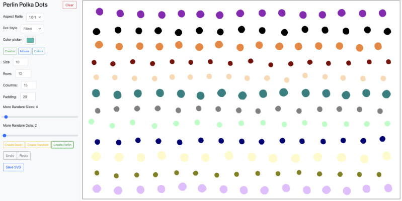

# [perlin-polka-dots](https://gregwattonville.github.io/perlin-polka-dots/)

## About

Perlin Polka Dots is a generative art project that I originally built in Processing, but after using p5js for a different project I wanted to move it online. Unfortunately p5js does not export to SVG; However, I didn't realize this until after I had already started the move. So there was some improvising with HTML's native SVG element. 

The menu ended up really busy because there are just so many variables and adjustments that can be made. And I wanted all these to be available for user. I was also doing a lot of testing with different types of randomness to see if I liked the effects. Unfortunately the codebase at some point got out of hand. Maybe, in the future, I can come back and clean it up, but I will probably move on to another project. 

There are three types of generative algorithms, I found that "Create Perlin" provides the best results. Each of the dots is drawn using Perlin noise to give them a hand painted look. The dot generators can be run multiple times at which point you can use "Draw History" to add all the previous dots back to the canvas. This was built to be art and fun, so enjoy messing around and breaking it.

## License

[GNU](LICENSE)